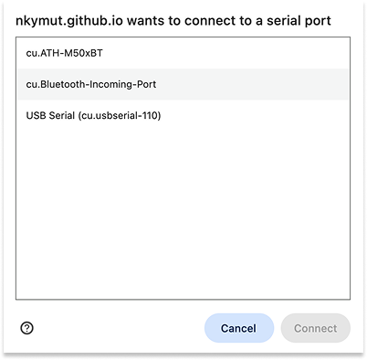

# Controlling Snake with an Arduino Controller

This folder contains two versions of the classic game "Snake" written in Processing 3.

 

## Snake Standalone

P5.js code: [Snake_Standalone](Snake_Standalone)

[Run Snake Standalone on GitHub Pages](https://nkymut.github.io/Electronics-As-Material/snake.p5/Snake_Standalone/) 

[Snake Standalone on p5.js editor](https://editor.p5js.org/didny/sketches/CW3YCe8hN)

Play Snake with the keyboard:

| key | action |
|---|---|
| `w` | up |
| `a` | left |
| `s` | down |
| `d` | right |
| `r` | reset |
| `o` | speed down |
| `p` | speed up | 

 

## Snake Serial

P5.js code: [Snake_Serial](Snake_Serial)

[Run Snake Serial on GitHub Pages](https://nkymut.github.io/Electronics-As-Material/snake.p5/Snake_Serial/) 

[Snake Serial on p5.js editor](https://editor.p5js.org/didny/sketches/NJRb-zhcT)

This P5.js sketch listens for commands coming over the serial port connected to the Arduino controller. 

First, click the "Connect Serial" button to connect to the Arduino.

The pop-up window will show the list of available serial ports. Select the port that corresponds to the Arduino. 

On Mac, the port name will be something like `/dev/cu.usbserial-0001`.
On Windows, the port name will be something like `COM3`.

**Note:** Arduino's serial port can only be connected to one application at a time. If you have the Arduino IDE Serial Monitor open, or another serial application connected, you must close it before connecting to the Snake game. 

<!-- 
To figure out which Serial port Processing should be listening to, open the run the following [Processing sketch](check_serial).

Check the print out in the black rectangle at the bottom of the processing IDE. You should see a series of lines, starting with `[ 0 ]` with the different ports your computer has. Find out with port Arduino uses. (Still not sure which is the Arduino? Check the serial port list in the Arduino IDE. Or, unplug the Arduino and run the Processing sketch and see which port disappears). -->

<!-- Change the value of `serial_port_index` in the `Snake_Serial.pde` file to match the port number corresponding to the Arduino. -->

The Arduino microcontroller controls the Snake game in Processing by sending text commands over the serial port, with the `Serial.println("text command")` function. List of text commands:

| text command | action |
|---|---|
| `"1"` | up |
| `"2"` | left |
| `"3"` | down |
| `"4"` | right |
| `"5"` | reset |
| `"6"` | speed down |
| `"7"` | speed up | 

Here is an [example Arduino code](https://app.arduino.cc/sketches/9495749f-97d7-4f49-9abe-1cbe66571d1b?view-mode=preview) that listens to the state of 5 push buttons and sends a different text command over serial depending on which button is pressed.

## Serial Terminal

P5.js code: [Serial_Terminal](serial_terminal)

[Run Serial Terminal on GitHub Pages](https://nkymut.github.io/Electronics-As-Material/snake.p5/serial_terminal/) 

[Serial Terminal on p5.js editor](https://editor.p5js.org/didny/sketches/t6M5I7tHj)

To test the communication between the Arduino controller and the P5.js sketch, you can use the Serial Terminal sketch above.

It displays the text commands received from the Arduino controller and allows you to send text commands to the Arduino controller.

## Serial Graph

P5.js code: [Serial_Graph](serial_graph)

[Run Serial Graph on GitHub Pages](https://nkymut.github.io/Electronics-As-Material/snake.p5/serial_graph/) 

[Serial Graph on p5.js editor](https://editor.p5js.org/didny/sketches/kRUEcMKTv)

This P5.js sketch visualizes the incoming serial data received from the Arduino controller in a graph.
